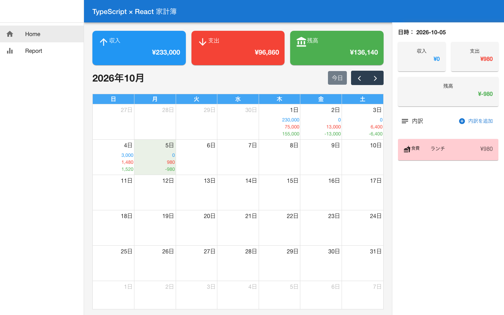
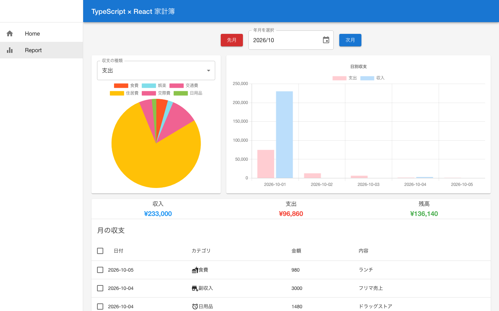

# 家計簿アプリ (React + TypeScript + Vite)

TypeScript と React を用いた Web アプリケーション作成の練習として作成した、簡易的な家計簿アプリです。
フロントエンドのみを実装し、データは Cloud Firestore から取得・更新しています。

**公開 URL: https://household-ts-e1a6c.web.app**

## スクリーンショット

### ホーム画面



### レポート画面



## 主な機能

### ホーム画面 (`/`)

- **月間サマリー**: 表示中の月の収入・支出・残高を表示
- **カレンダー**: 日ごとの収入・支出・残高をカレンダー上に表示し、日付をクリックするとその日の取引を確認可能
- **日別サマリー / 取引一覧**: 選択した日の収支と取引内容を一覧表示
- **取引の登録・編集・削除**: フォームから収入 / 支出の登録、既存取引の更新・削除が可能

### レポート画面 (`/report`)

- **月の切り替え**: 表示する月を選択
- **カテゴリ別円グラフ**: 収入 / 支出を切り替えてカテゴリごとの割合を表示
- **日別棒グラフ**: 日ごとの収入・支出を棒グラフで表示
- **取引テーブル**: 月間の取引を一覧表示し、複数選択して一括削除が可能

### カテゴリ

| 種類 | カテゴリ                                       |
| ---- | ---------------------------------------------- |
| 収入 | 給与 / 副収入 / お小遣い                       |
| 支出 | 食費 / 日用品 / 住居費 / 交際費 / 娯楽 / 交通費 |

## 使用技術

| 分類           | 技術                                     |
| -------------- | ---------------------------------------- |
| 言語           | TypeScript                               |
| フレームワーク | React 19 / Vite                          |
| UI             | MUI (Material UI), Emotion               |
| ルーティング   | React Router                             |
| カレンダー     | FullCalendar                             |
| グラフ         | Chart.js / react-chartjs-2               |
| フォーム       | React Hook Form + Zod (バリデーション)   |
| 日付処理       | date-fns, MUI X Date Pickers             |
| データベース   | Cloud Firestore                          |
| ホスティング   | Firebase Hosting                         |

## ディレクトリ構成

```
src/
├── App.tsx            # ルーティングと Firestore への CRUD 処理
├── firebase.ts        # Firebase の初期化
├── pages/             # Home / Report / NoMatch ページ
├── components/        # カレンダー・グラフ・フォームなどの UI コンポーネント
│   ├── layout/        # 共通レイアウト
│   └── common/        # サイドバー・アイコン
├── types/             # 型定義
├── utils/             # 日付フォーマット・収支計算
├── validations/       # Zod スキーマ
└── theme/             # MUI テーマ
```

## ローカルでの実行方法

### 1. 依存パッケージのインストール

```bash
npm install
```

### 2. 環境変数の設定

プロジェクト直下に `.env` を作成し、Firebase プロジェクトの設定値を記入します。

```
VITE_API_KEY=
VITE_AUTH_DOMAIN=
VITE_PROJECT_ID=
VITE_STORAGE_BUCKET=
VITE_MESSAGING_SENDER_ID=
VITE_APP_ID=
```

Firestore には `Transactions` コレクションを使用します。

### 3. 開発サーバーの起動

```bash
npm run dev
```

## スクリプト

| コマンド          | 内容                         |
| ----------------- | ---------------------------- |
| `npm run dev`     | 開発サーバーを起動           |
| `npm run build`   | 型チェック後に本番ビルド     |
| `npm run preview` | ビルド結果をローカルで確認   |
| `npm run lint`    | ESLint による静的解析        |

## デプロイ

Firebase Hosting にデプロイしています。

```bash
npm run build
firebase deploy
```
